# Trim 👀

**Find cloud waste before it finds your budget.**

Trim is a dashboard that scans your cloud and highlights what’s wasting money: idle VMs, unattached disks, unused IPs, oversized instances. Each finding comes with an **AI explanation** and a clear next step so you can cut costs without digging through consoles. **Currently supports GCP only**; AWS, Azure, and Kubernetes are planned.

```mermaid
flowchart LR
  subgraph you["You"]
    A[Connect GCP]
    B[Overview]
    C[Chat]
  end
  subgraph trim["Trim"]
    D[Pages]
    E[Worker]
    G[RAG context]
    H[Workers AI]
  end
  subgraph cloud["Cloud"]
    F[Compute · Billing · Metrics]
  end
  A --> D
  B --> D
  C --> D
  D --> E
  E --> F
  F -.->|waste + costs| E
  E --> G
  G -->|overview + highlights + billing| H
  H -.->|answers| E
  E -.->|highlights + AI| D
```



---

## What it does

- **Connects** to your GCP project via a service account (credentials encrypted and stored in Cloudflare KV).
- **Surfaces waste** — stopped VMs still billing, disks with no attachment, low CPU/RAM instances, reserved but unassigned IPs.
- **Billing view** — top services by cost, optional BigQuery export for potential savings.
- **Chat** — ask Trim questions about your waste and costs. The backend uses **RAG**: it fetches your live overview (resources, waste, billing), injects it as context into the model, so the bot answers with your actual data and can suggest what to fix first.

One overview, one “what to fix” list, one place to see where money is leaking.

---

## Tech

| | |
|---|---|
| **Backend** | Cloudflare Workers (Python), KV, Workers AI (Llama) with **RAG** — overview/waste/billing as context for the assistant |
| **Frontend** | React 18, Vite, TypeScript, Tailwind, React Query |
| **Hosting** | Worker on Workers, UI on Cloudflare Pages |

The backend follows **hexagonal architecture** (ports & adapters): the `CloudProvider` interface is the port; GCP (and future AWS/Azure/K8s) are adapters that talk to each cloud’s APIs. HTTP routes call into the port, so the core flow stays independent of the cloud or transport.

---

## Try it

- **Live app:** [trim-frontend.pages.dev](https://trim-ai.pages.dev/) *(or your Pages URL)*  
- **API:** [trim-worker.*.workers.dev](https://trim-worker.fabiodiceglie.workers.dev)

Connect with a GCP service account that has Compute Viewer, Monitoring Viewer, Billing Account Viewer, and Project Viewer.

---

## Run locally

**Env first:**  
- **Worker:** copy `worker/.dev.vars.example` to `worker/.dev.vars` and set `ENCRYPTION_KEY` (e.g. `python3 -c "import os,base64; print(base64.b64encode(os.urandom(32)).decode())"`).  
- **Frontend:** create `frontend/.env` with `VITE_API_URL=http://localhost:8787` (see `frontend/.env.example`).

```bash
# Worker (from repo root)
cd worker
npx wrangler dev

# Frontend (another terminal)
cd frontend
npm install && npm run dev
```

---

## Project layout

```
trim/
├── worker/           # Cloudflare Worker — connect, GCP provider, chat
│   └── src/
│       ├── entry.py           # Router
│       ├── routes/            # connect, health, chat
│       ├── providers/gcp/     # compute, metrics, billing, overview
│       └── services/          # credentials (KV), crypto (AES-GCM)
└── frontend/         # React app — onboarding, overview, chat
    └── src/
        ├── pages/             # Onboarding, Overview
        ├── api/               # client (connect, projects, overview, chat)
        └── components/        # Layout, Chat
```

---

*Trim — see the waste, fix the cost.*
